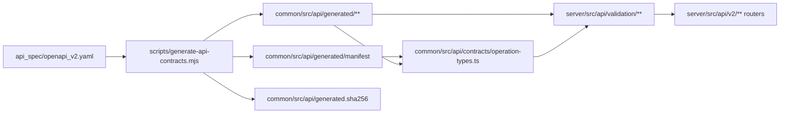
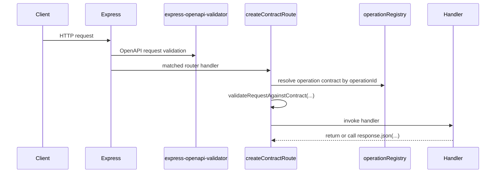
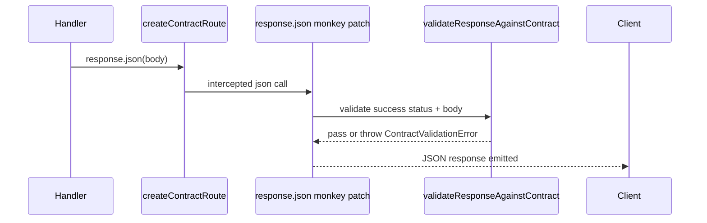

# API Contract Closeout

This document is the migration closeout and engineering handoff for Sproot's generated API contract system. It describes the final architecture, runtime validation flow, deterministic generation workflow, intentional exclusions, known debt, operational guidance, and the safe developer workflow for future endpoint changes.

## Final Architecture

The contract system has four layers:

1. `api_spec/openapi_v2.yaml` is the canonical external API contract.
2. `scripts/generate-api-contracts.mjs` slices that spec into stable domains and generates committed TypeScript, Zod, YAML, and manifest artifacts under `common/src/api/generated`.
3. `common/src/api/contracts/operation-types.ts` turns the generated manifest and domain exports into typed operation identifiers and operation-specific request and response types.
4. `server/src/api/validation` consumes those generated contracts at runtime through `operationRegistry`, `createContractRoute`, `validateRequest`, and `validateResponse`.



### Domain Layout

Generated contracts are intentionally split by stable API domains instead of emitted as one monolith. The current domains are `auth`, `ping`, `system`, `subcontrollers`, `outputs`, `automations`, `sensors`, `device-zones`, `camera`, `tags`, and `journals`.

### Ownership Rules

- `api_spec/openapi_v2.yaml` is the only source of truth for public transport contracts.
- `scripts/generate-api-contracts.mjs` is the only supported generation entry point.
- `common/src/api/generated` is generated-only and must not be edited by hand.
- `common/src/api/generated.sha256` is the committed drift baseline for the generated tree.
- Runtime validation logic belongs in `server/src/api/validation` and should consume generated schemas rather than duplicate contract definitions.

Generated TypeScript and YAML files include generated-file warnings. The manifest JSON cannot carry comments, but it is still generated-only.

## Runtime Validation Flow

The server currently runs two validation layers:

- legacy `express-openapi-validator` middleware in `server/src/api/v2/ApiRootV2.ts`
- generated-contract validation in `server/src/api/validation/**`

The generated layer is the long-term transport contract path. The legacy layer remains active as a compatibility bridge and is documented under technical debt below.

### Request Lifecycle



Request validation behavior:

- `createContractRoute(operationId, handler)` resolves the generated contract once when the route wrapper is created.
- Before the handler runs, `validateRequestAgainstContract` validates path, query, body, and header inputs against generated Zod schemas.
- Parameter normalization converts common string transport values into schema-compatible scalars where appropriate, including booleans and numbers.
- Validation failures are raised as `ContractValidationError` with `phase = "request"`, HTTP status `400`, the operation id, and field-level details.

### Response Lifecycle



Response validation behavior:

- `createContractRoute` temporarily monkey-patches `response.json` for the lifetime of the route handler.
- When a handler emits JSON, `validateResponseAgainstContract` checks the generated success response before the payload is sent.
- Validation applies only to successful HTTP statuses and only when the registry marks the operation as response-validatable.
- If generated metadata declares a canonical success status, the runtime status must match it.
- If the response body includes a `statusCode`, that field must match the actual HTTP status.
- The success payload is parsed with the generated Zod schema from the registered endpoint.
- Validation failures are raised as `ContractValidationError` with `phase = "response"` and HTTP status `500`.

### How `operationRegistry` Works

`server/src/api/validation/operationRegistry.ts` is the runtime index of generated contracts.

It performs these responsibilities at startup:

1. Imports every generated domain API surface from `@sproot/sproot-common/dist/api/generated`.
2. Reads `generatedApiContractManifest` and iterates every domain and operation id.
3. Locates the matching generated Zodios endpoint definition by alias.
4. Extracts request body, path, query, and header schemas into a normalized `OperationContract` object.
5. Computes response validation behavior, including intentional exclusions.
6. Fails fast on duplicate operation ids, missing generated endpoint metadata, or operation count drift.

This gives the runtime layer one authoritative lookup table keyed by `ContractOperationId`.

### How `createContractRoute` Works

`server/src/api/validation/createContractRoute.ts` is the route-level integration point.

It performs these steps for each wrapped route:

1. Resolve the operation contract from `operationRegistry`.
2. Optionally validate the incoming request with `validateRequestAgainstContract`.
3. Temporarily replace `response.json` so outgoing JSON success bodies are validated before emission.
4. Run the actual handler.
5. Restore the original `response.json` in `finally`, even when the handler throws.

This wrapper keeps validation attached to concrete operation ids instead of relying on ad hoc handler-level checks.

### How to Debug `ContractValidationError`

`ContractValidationError` is the canonical exception type for generated request and response mismatches.

When debugging one:

1. Capture `operationId`, `phase`, `method`, `url`, and `details` from the API v2 logger output.
2. Open `server/src/api/validation/operationRegistry.ts` and confirm whether the operation is excluded or expected to validate.
3. Check the generated domain client under `common/src/api/generated/<domain>/client.ts` to inspect the concrete Zod schema for the operation alias.
4. Compare the live handler payload with the generated success schema, not just the TypeScript types.
5. If the mismatch is real, update `api_spec/openapi_v2.yaml`, regenerate contracts, and re-run verification.
6. If the runtime behavior is intentionally non-JSON, verify whether the operation belongs in the non-JSON exclusion set rather than weakening the schema for JSON routes.

The API v2 error middleware logs contract validation failures with:

- operation id
- validation phase
- HTTP method
- URL
- field-level details

Request failures log at warning level. Response failures log at error level.

## Validation Responsibility Map

The current pipeline is easiest to reason about when split into five responsibility classes.

### 1. Transport Validation

Transport validation answers whether an HTTP request or response matches the public contract shape.

Owned primarily by:

- `server/src/api/validation/createContractRoute.ts`
- `server/src/api/validation/validateRequest.ts`
- `server/src/api/validation/validateResponse.ts`
- `server/src/api/validation/operationRegistry.ts`
- generated domain schemas in `common/src/api/generated/*/client.ts`

Examples:

- required request body fields
- query/header/path presence and scalar parsing
- success response body structure
- response `statusCode` field matching the emitted HTTP status

### 2. Schema Validation

Schema validation is the concrete Zod parse step driven by generated artifacts.

Owned by:

- Zod schemas emitted by `openapi-zod-client` in `common/src/api/generated/*/client.ts`
- request/response parsing in `validateRequest.ts` and `validateResponse.ts`
- endpoint metadata extraction in `operationRegistry.ts`

Examples:

- enum membership enforced by generated Zod enums
- request-body object shape validation
- query boolean and number coercion before Zod parsing

### 3. Domain / Business Validation

Domain validation is intentionally still handler-owned where the rule depends on runtime semantics rather than transport shape.

Representative examples:

- sensor create pin requirements that depend on sensor model in `server/src/api/v2/sensors/handlers/SensorHandlers.ts`
- condition-specific automation rules in `server/src/api/v2/automations/handlers/ConditionHandlers.ts`
- journal and tag lifecycle rules in journal and tag handlers
- output-device existence checks and PWM normalization in automation action handlers

This remains in handlers by design. The contract layer should reject malformed transport data, not recreate the entire runtime rule engine.

### 4. Persistence / Runtime Validation

Persistence and runtime validation answers whether the system can actually perform the requested action after the request is transport-valid.

Representative examples:

- database reachability failures
- hardware availability and device lookup failures
- camera stream and firmware download behavior
- backup file existence and archive generation state

These remain handler- and service-owned. They are not contract debt.

### 5. Compatibility-Preservation Behavior

Compatibility-preservation behavior is the deliberate set of semantics that remain looser than the strictest possible schema because the live API already behaves that way and the migration did not aim to redesign it.

Representative examples:

- parseInt-based ID handling and mixed string-or-number path semantics in multiple handlers
- `latest` query behavior remaining string-driven in chart-data handlers
- output and sensor PATCH fallback reads from raw `request.body` for undeclared writable fields
- legacy validator bridge still running alongside generated validation in `server/src/api/v2/ApiRootV2.ts`

These behaviors are intentional stop-points, not unfinished cleanup.

## Generation Flow And CI Enforcement

### Canonical Regeneration Workflow

The only supported regeneration command is:

```bash
npm run generate:api-contracts
```

Run it from the repository root.

The generator performs these steps:

1. Parse `api_spec/openapi_v2.yaml`.
2. Assert the expected operation count.
3. Slice the OpenAPI spec into stable domains by path prefix.
4. Emit per-domain `openapi.yaml`, `types.ts`, `client.ts`, and `index.ts` files.
5. Emit a generated manifest in both JSON and TypeScript form.
6. Add generated-file headers.
7. Write the canonical tree hash to `common/src/api/generated.sha256`.

### Deterministic Generation Enforcement

Determinism is enforced by:

```bash
npm run verify:api-contracts
```

`scripts/verify-api-contracts.mjs` runs the generator twice, hashes the entire generated tree after each run, and then fails if either of these is true:

- the two generated hashes differ, proving nondeterministic output
- the final hash differs from the committed `common/src/api/generated.sha256`, proving drift

This makes `verify:api-contracts` both a determinism check and a repository drift check.

### CI Enforcement

CI runs `npm run verify:api-contracts` before unit tests and API tests in `.github/workflows/Test.yaml`.

If CI fails on this step, the expected remediation is:

1. update `api_spec/openapi_v2.yaml` or generator code as intended
2. run `npm run generate:api-contracts`
3. review generated output and `common/src/api/generated.sha256`
4. commit the generated changes
5. re-run `npm run verify:api-contracts`

## Developer Workflow

### Regenerating Contracts Safely

Use this workflow whenever a public endpoint contract changes:

1. Edit `api_spec/openapi_v2.yaml` first.
2. Ensure the endpoint has the correct `operationId` and schema definitions.
3. Run `npm run generate:api-contracts` from the repository root.
4. Review changes under `common/src/api/generated/**`, `common/src/api/generated/manifest/**`, and `common/src/api/generated.sha256`.
5. Run `npm run verify:api-contracts`.
6. Build `common` and `server` if the change affects runtime wiring.
7. Run relevant tests, especially API tests for the touched endpoint.

Do not hand-edit generated files to make verification pass.

### Adding New Endpoints Safely

Use this workflow for a new API route:

1. Add or update the endpoint in `api_spec/openapi_v2.yaml` with a unique `operationId`.
2. Ensure request parameters, request body, and success response are fully described in the spec.
3. Regenerate contracts with `npm run generate:api-contracts`.
4. Verify the new operation appears in the correct generated domain and in the manifest.
5. Wire the server route with `createContractRoute("yourOperationId", handler)`.
6. Return JSON payloads that match the generated success schema exactly.
7. Add request and response tests, including at least one negative-path validation test when practical.
8. Only add a response exclusion if the endpoint is truly non-JSON transport and cannot be represented as a JSON success body.

### Runtime Validation Checklist For Endpoint Authors

Before merging an endpoint change, verify all of the following:

- request path params, query params, headers, and body are represented in the OpenAPI spec
- success response schema matches the real JSON payload
- HTTP success status matches the generated endpoint metadata
- handler-level `statusCode` fields match the actual HTTP status
- the route is wrapped with the correct operation id
- the endpoint is not added to the exclusion registry unless it is transport-driven

## Remaining Intentional Exclusions

Response validation exclusions are intentionally limited to non-JSON success transports.

Current intentional exclusions:

- `downloadSystemBackup`
- `downloadEsp32FirmwareBinary`
- `downloadEsp32FirmwareBootloader`
- `downloadEsp32FirmwarePartitions`
- `downloadEsp32FirmwareApplication`
- `getCameraStream`
- `getLatestCameraImage`
- `downloadTimelapseArchive`

Why these remain excluded:

- they return binary, archive, image, or multipart stream responses
- the current generated runtime path validates JSON success bodies only
- keeping them excluded avoids weakening JSON response validation for the rest of the API

These are intentional transport exclusions, not schema-parity debt.

## Known Technical Debt

The migration is operational, but these items remain deliberately unresolved:

- `express-openapi-validator` is still active in `server/src/api/v2/ApiRootV2.ts`, so request and response validation currently run through both the legacy and generated layers.
- `scripts/generate-api-contracts.mjs` uses `stabilizeZodClientTypes(...)`, which relies on exact string replacements against generator output and is therefore brittle to upstream output changes.
- The generated manifest is emitted twice, once as JSON and once as TypeScript, which duplicates the same metadata in two committed artifacts.
- Several transport-facing schema names in the OpenAPI document still reflect persistence models, which leaks repository naming into the public contract surface.
- Error-response validation is still intentionally excluded from the generated runtime path.
- Negative-path tests around contract validation are thinner than the positive-path API coverage.
- `validateRequest.ts` and `validateResponse.ts` still expose default exports that appear to be compatibility leftovers rather than the dominant runtime entry points.

### Exact Intentional Stop-Points

These are the remaining places where human reviewers should read the code as intentionally deferred rather than partially migrated:

- `server/src/api/v2/outputs/handlers/OutputHandlers.ts`
	- schema-owned PATCH fields consume validated data first
	- `subcontrollerId`, `automationTimeout`, `deviceZoneId`, and `parentOutputId` still intentionally fall back to raw body input to preserve current runtime behavior
- `server/src/api/v2/sensors/handlers/SensorHandlers.ts`
	- create-time model membership is now contract-owned
	- create-time pin requirements remain handler-owned because they are model-dependent runtime rules
	- update still mixes validated and fallback body reads because the contract intentionally does not claim full PATCH parity
- `server/src/api/v2/automations/handlers/ConditionHandlers.ts`
	- this remains the largest intentionally handler-owned domain surface
	- it still relies heavily on raw path/body parsing and condition-specific business rules
- `server/src/api/v2/system/BackupHandlers.ts`, `server/src/api/v2/camera/handlers/*`, and `server/src/api/v2/subcontrollers/handlers/ESP32Handlers.ts`
	- these continue to own transport-adjacent runtime behavior that was not worth broadening in this migration phase

These stop-points are acceptable because the migration goal was contract-first boundary hardening, not total handler normalization.

## Zodios And openapi-zod-client Coupling Inventory

### Runtime dependencies on Zodios-derived types or metadata

The committed runtime depends on Zodios in three concrete ways:

1. `common/src/api/contracts/operation-types.ts`
	 - imports `ZodiosBodyByAlias`, `ZodiosPathParamByAlias`, `ZodiosQueryParamsByAlias`, `ZodiosHeaderParamsByAlias`, and `ZodiosResponseByAlias`
	 - uses them to derive per-operation request and response aliases from generated domain APIs
2. `server/src/api/validation/operationRegistry.ts`
	 - imports generated domain clients and reads each domain's `.api` endpoint definition array
	 - depends on endpoint alias, parameter metadata, `endpoint.response`, and optional `endpoint.status`
3. generated `common/src/api/generated/*/client.ts` files
	 - import `@zodios/core`
	 - emit `makeApi(...)`, `ZodiosEndpointDefinitions`, `ZodiosInstance`, and `new Zodios(...)`

### Where openapi-zod-client artifacts are consumed

`openapi-zod-client` output is consumed in these places:

- directly by `server/src/api/validation/operationRegistry.ts` via generated domain `.api` endpoint metadata
- directly by `common/src/api/contracts/operation-types.ts` via generated domain API types used by Zodios alias generics
- indirectly by `server/src/api/validation/validateRequest.ts` and `validateResponse.ts` through the normalized contracts built by `operationRegistry.ts`
- indirectly by handlers through `getValidatedContractRequestData<T>()`, which returns types derived from `operation-types.ts`

### Where generated endpoint metadata is required

Generated endpoint metadata is required only in one runtime place:

- `server/src/api/validation/operationRegistry.ts`

That file requires these generated endpoint properties:

- `alias`
- `parameters`
- `response`
- optional `status`

No handler reads generated endpoint metadata directly.

### Where generated TypeScript aliases are used

Generated TypeScript aliases are consumed in two patterns:

1. centralized aliases in `common/src/api/contracts/operation-types.ts`
2. handler-local aliases that import generated `operations` types from `common/src/api/generated/*/types.ts`

Representative handler-local usage exists in:

- `server/src/api/v2/authentication/handlers/TokenHandlers.ts`
- `server/src/api/v2/outputs/handlers/OutputHandlers.ts`
- `server/src/api/v2/outputs/handlers/OutputStateHandlers.ts`
- `server/src/api/v2/outputs/handlers/OutputChartDataHandlers.ts`
- `server/src/api/v2/sensors/handlers/SensorHandlers.ts`
- `server/src/api/v2/journals/handlers/JournalsHandlers.ts`
- `server/src/api/v2/journals/handlers/JournalEntriesHandlers.ts`
- `server/src/api/v2/tags/handlers/*.ts`
- `server/src/api/v2/subcontrollers/handlers/SubcontrollerHandlers.ts`
- `server/src/api/v2/automations/handlers/*.ts`

### Why `openapi-typescript` still matters

`openapi-typescript` provides the generated `operations` and schema types under `common/src/api/generated/*/types.ts`. These are still the most useful source for handler-local compile-time request and response aliases, even when runtime validation is driven by Zod schemas from `openapi-zod-client`.

## Future Decoupling Roadmap

This section is analysis only. It does not recommend immediate implementation.

### What can stay exactly the same

If Zodios runtime coupling is removed later, these pieces can remain conceptually unchanged:

- `api_spec/openapi_v2.yaml` stays the single source of truth
- domain slicing in `scripts/generate-api-contracts.mjs` can stay
- generated Zod request and response schemas remain the runtime validation mechanism
- handwritten Express routers and handlers remain the execution model
- `createContractRoute.ts` can remain essentially unchanged
- most of `validateRequest.ts` can remain unchanged
- most of `validateResponse.ts` can remain unchanged

### What would need to replace Zodios-derived metadata

To decouple from Zodios runtime metadata cleanly, generation would need to emit a plain registry shape per operation containing at least:

- `operationId`
- method
- path
- request body schema
- path/query/header parameter schema list
- success response schema
- optional canonical success status

That would let `operationRegistry.ts` consume plain generated metadata without reading `.api` arrays from Zodios endpoint definitions.

### What would need to change in `operation-types.ts`

`common/src/api/contracts/operation-types.ts` would need the largest type-level rewrite.

Today it derives request and response aliases through Zodios alias helpers. Without Zodios it would instead need to derive those aliases from a plain generated manifest or per-operation generated type map. In practice that means:

- removing all imports from `@zodios/core`
- replacing `ContractGeneratedApi<OperationId>`-based derivation with direct generated operation maps
- keeping `ContractOperationId` and domain lookup behavior intact if possible

### What would need to change in `operationRegistry.ts`

`server/src/api/validation/operationRegistry.ts` would need to stop importing domain `.api` arrays and instead import the new plain generated registry. The rest of the file could stay structurally similar:

- iterate manifest domains and operation ids
- look up generated operation metadata
- normalize request parameter groups
- build `OperationContract`
- keep the response exclusion map

### Can `createContractRoute.ts` and `validateRequest.ts` remain essentially unchanged?

Yes.

As long as `operationRegistry.ts` continues to return the same normalized `OperationContract` shape, both `createContractRoute.ts` and `validateRequest.ts` can remain essentially unchanged. Their current design is already decoupled from direct generator format details.

### Recommended decoupling sequence if it is ever pursued

1. Extend generation to emit a plain per-operation registry alongside current artifacts.
2. Teach `operationRegistry.ts` to read the plain registry while keeping the existing public `OperationContract` shape unchanged.
3. Rewrite `operation-types.ts` to use the plain generated operation maps instead of Zodios alias helpers.
4. Only after parity is proven, remove Zodios-specific generation output from the runtime path.
5. Keep `openapi-typescript` and generated Zod schemas; do not couple decoupling to a broader framework rewrite.

### Is the architecture already good enough to stop here?

Yes.

The current architecture is already good enough to stop here for the intended migration scope because:

- the runtime validation path is centralized and deterministic
- handlers consume typed validated data through one shared boundary API
- remaining debt is explicit and mostly compatibility-driven rather than accidental
- future decoupling can be done behind `operationRegistry.ts` and `operation-types.ts` without reopening every route handler

## Review Preparation

### Major architectural improvements achieved

- OpenAPI is now the authoritative contract source for the migrated boundary path.
- Generated request and response validation is centralized under `server/src/api/validation` instead of being scattered across handlers.
- Route wiring is now operation-id driven through `createContractRoute(...)`.
- Validated request data is stored once on `response.locals` and consumed consistently by handlers.
- Contract generation is deterministic and CI-verifiable through `verify:api-contracts`.

### What became contract-owned

- request transport shape validation for wrapped routes
- query/header/path coercion and validation
- success response JSON validation for non-excluded operations
- enum precision where the OpenAPI contract was tightened, including the sensor create model surface

### What became materially more type-safe

- handler-local request aliases sourced from generated `operations` types
- shared `ContractOperation*` aliases in `common/src/api/contracts/operation-types.ts`
- validated request access through `getValidatedContractRequestData<T>()`
- output PATCH precedence for schema-owned fields

### What materially improved in generated Zod validation

- runtime request parsing is now driven by generated schemas instead of hand-maintained transport checks for the migrated slices
- response validation can now detect contract/runtime drift on JSON success paths
- sensor create model validation and other tightened schema surfaces now fail at the boundary instead of inside handlers

### What intentionally remained handler-owned

- model-dependent sensor rules
- automation condition business rules
- hardware existence and runtime availability checks
- database and service failure handling
- compatibility-preserving PATCH behavior for undeclared writable fields

### What intentionally remained permissive

- parseInt-compatible path semantics
- chart-data `latest` string behavior
- output and sensor PATCH fallback handling for fields the contract does not yet own
- non-JSON response exclusions
- legacy validator bridge

### Highest-value migrations

- introducing `createContractRoute(...)` as the single route-level integration point
- centralizing runtime contract lookup in `operationRegistry.ts`
- deriving typed validated request data from generated artifacts
- tightening sensor create enums and similar safe schema-precision improvements
- fixing the output chart-data shared-state mutation uncovered during stabilization

### Intentionally abandoned as low value

- forcing full PATCH parity where runtime behavior is still broader than the contract
- broad normalization of condition handlers during this migration
- redesigning permissive ID semantics into stricter transport rules
- removing legacy validation and Zodios coupling in the same change stream

### Highest-risk files for reviewer attention

- `server/src/api/validation/operationRegistry.ts`
- `server/src/api/validation/createContractRoute.ts`
- `server/src/api/validation/validateRequest.ts`
- `server/src/api/v2/outputs/handlers/OutputHandlers.ts`
- `server/src/api/v2/sensors/handlers/SensorHandlers.ts`
- `server/src/api/v2/automations/handlers/ConditionHandlers.ts`
- `scripts/generate-api-contracts.mjs`

### Areas most likely to contain subtle regressions

- request precedence between validated values and raw Express values
- response validation on large JSON payloads
- generator post-processing via `stabilizeZodClientTypes(...)`
- mixed validated and fallback PATCH logic in sensors and outputs

### Areas with the strongest test coverage

- route-level contract behavior across sensors, outputs, automations, journals, tags, subcontrollers, and system endpoints
- direct handler precedence tests that prove validated request data wins over raw Express inputs on migrated slices
- contract-route wrapper behavior in `server/src/api/validation/createContractRoute.spec.ts`
- output chart-data regression coverage around non-mutation behavior

### Areas intentionally relying on backward-compatibility semantics

- automation condition handlers
- output PATCH fallback fields
- sensor update fallback fields
- chart-data `latest` string handling
- path parameter parseInt behavior across multiple handlers

## Operational Risks And Monitoring Recommendations

### Operational Risks

- Dual validation layers can create duplicate work, duplicate failure modes, and harder-to-interpret validation errors.
- Response validation on large JSON success payloads adds real parsing cost, especially on chart-style endpoints.
- Contract drift becomes a release risk if generated artifacts are modified or omitted outside the canonical workflow.
- The generator post-processing step can break silently if upstream codegen output changes format.
- Non-JSON endpoints will remain unvalidated on the generated response path until transport-aware validation is added.

### Monitoring Recommendations

Monitor these signals in production and CI:

1. Count `ContractValidationError` events by `operationId` and `phase`.
2. Alert on any response-phase validation failure because it indicates contract/runtime divergence in a success path.
3. Track warning-level request validation failures separately from server-side 500s.
4. Keep `verify:api-contracts` mandatory in CI and investigate any nondeterminism immediately.
5. Watch latency on large JSON endpoints after schema changes that widen response bodies.
6. Periodically review the exclusion registry to confirm every excluded operation is still transport-driven.

## Suggested Backlog Items

These are the next actionable improvement items after closeout:

1. Remove the legacy `express-openapi-validator` bridge once generated validation coverage and confidence are sufficient.
2. Replace the string-based `stabilizeZodClientTypes(...)` post-processing with a less brittle generator integration.
3. Add generated negative-path API tests for request and response validation failures on representative endpoints.
4. Add transport-aware runtime validation or explicit adapter support for binary, image, archive, and multipart success responses.
5. Rename persistence-shaped OpenAPI component names to transport-oriented names where public contract clarity matters.
6. Consolidate duplicated manifest outputs if the JSON artifact is no longer required by any tooling.
7. Decide whether the default exports in `validateRequest.ts` and `validateResponse.ts` should be removed or formally retained as compatibility APIs.